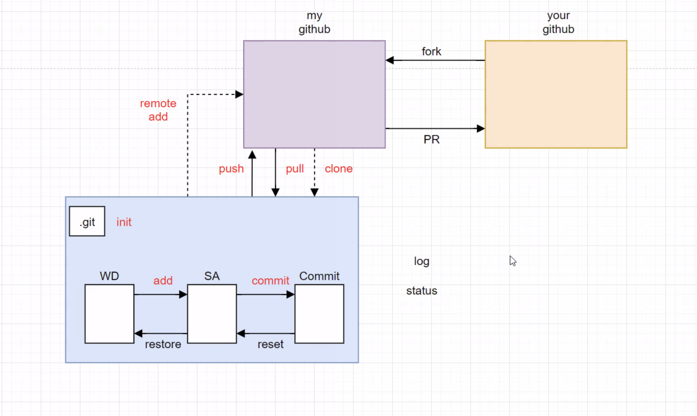

# github for beginner

### `touch < file name > .md ` 

* `touch` 는 create과 같은 의미이다. 
* 깃 명령어가 아닌 기본 탐색 명령어이다.

### `git status` 

```bash
git status

On brance master
Untracked files:
		(use "git add <file>..." to include in what will be 		committed)
```

### `git add < file name > .md` 

### `git commit -m "< Message >"`

### `git push origin master`

# git의 작업흐름




### add -> commit -> push 

`add` 커밋할 목록에 추가

`commit`  커밋 (create a snapshot) 만들기

`push`  


`git commit -m "message"` 

message : 여기에 메세지 설명

* 뼈대 코드 구성
* 메인 기능 구현 등등


> commit convention 날짜 | 수정한 내용 적기

## 요약

`git config --global user.name "name"` : 초반 이름 설정 

`git config --global user.email "github email address"` : 깃허브 메일주소

`mkdir  <project_name>` : local directory 생성

`cd <project_name>` : directory로 이동

`git init` : 깃 명령어를 사용할 수 있는 directory로 설정

`git status` : 깃 현재 상태 확인

`git log` : 깃 로그 확인

`git add filename.filetype`  : 특정파일 올리기

`git add .` : 모든 파일 올리기 

`git commit -m "message"` : 커밋해서 스냅샷

`git remote add origin <url>` : local과 remote repository 연결

`git push origin master` : remote로 푸시 (깃허브로 푸시)

`git pull origin master` : local로 remote변경사항 받아옴 (깃허브에서 내 컴으로 변경사항 받기)

=========================================================================

`.gitignore` 파일 만들고 `git touch .gitignore` 또는 VS code에서 파일만들기  

.gitignore에 파일 이름 올리면 파일 숨겨짐

즉, 깃으로 관리하지 않아도 되는 파일들 이름을 적기

e.g. b.txt --> 파일 숨김

e.g. test/ --> 폴더 숨김

* 근데 하나씩 입력하기 힘드니까  https://www.toptal.com/developers/gitignore 자동으로 만들어줌

`git status` : 저장소 상태를 체크 


### 브랜치 (Branch)

`git branch <branch name>` : 새로운 브랜치 만들기 

`git switch branch <branch name>` : 브랜치 변경

e.g. `git switch branch 'master'` : 마스터 브랜치로 변경

`git merge` : 브랜치에서 작업 끝내고 master 브랜치로 병합 

e.g. `git merge <branch name>` --> fast-forward 전략

`git branch -d <branch name>` : 브랜치 삭제


* https://git-scm.com/book/en/v2 git 기본서 

