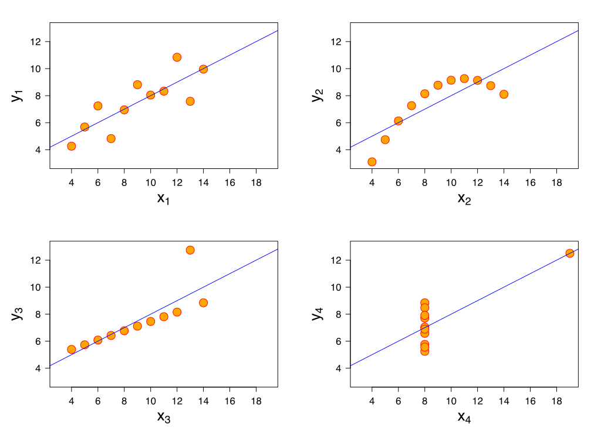
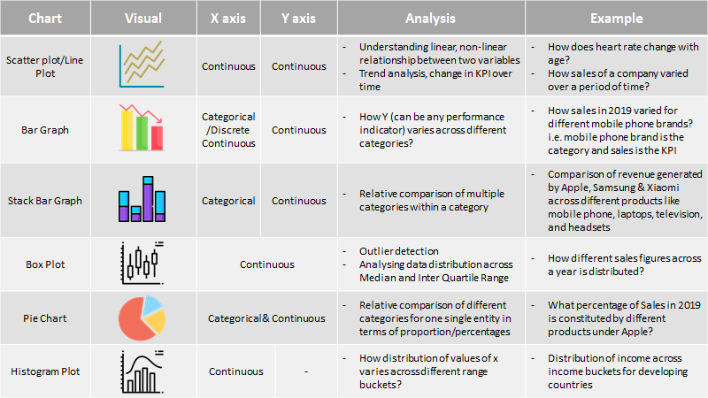

# visualisation tool

critical point for data scientists : how to communicate data through proper visualisation 

Data truth-telling

* have to look at your data closely 
* apply appropriate stats
* set the correct model parameters 

###  unnecessary visualisation 

* when you have only two datapoints 

### Anscombe's Data Quartet

* it shows how a pair of X and Y can have different values yet have differnt central tendency and correlation values (Francis, 1973)
* 

## scatterplot 

* classic and fundamental plot used to study the relationship between two variables 
* may want to visualise multiple group in a different colour. 
* `plt.scatterplot` 

data distribution

* distribution of the data, look for central tendencies (mean, median, and mode)
* understand the presence of outliers using a boxplot, check for skewness, and ever understand the impact of winsorisation on data distribution. 

https://towardsdatascience.com/data-visualization-in-data-science-5681cbdde5bf

