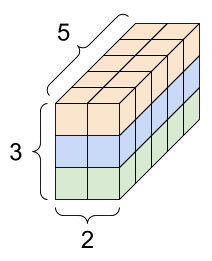

# 데이터의 유형

### scalar 

- 하나의 숫자로만 이루어진 데이터
- x∈R

### vector

* 여러 숫자가 순서대로 모여 있는 것
* 일차원 배열
* x∈R64

### matrix

* 2차원 배열

### tensor

* 3차원 이상의 배열 

  	

  𝑥∈R 3x2x5

  |𝑥| = (3,2,5)

  

### about tensor shapes...

* Shape : The length (number of elements) of each of the axes of a tensor

* Rank : Number of tensor axes. A scalar has rank 0, a vector has rank 1, a matrix is rank 2.

* Axis or Dimension : A particular dimension of tensor

* Size : The total number of items in the tensor, the product shape vector. 

  e.g. 	A rank-4 tensor, shape : [3,2,4,5]

  

  

