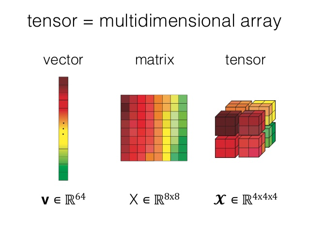

# 데이터의 유형

### scalar 

- 하나의 숫자로만 이루어진 데이터
- x∈R

### vector

* 여러 숫자가 순서대로 모여 있는 것
* 일차원 배열
* x∈R64

### matrix

* 2차원 배열

### tensor

* 3차원 이상의 배열 

  

  

  

  

  

  𝑥∈R 3x2x5

  |𝑥| = (3,2,5)

  

### about tensor shapes...

* Shape : The length (number of elements) of each of the axes of a tensor

* Rank : Number of tensor axes. A scalar has rank 0, a vector has rank 1, a matrix is rank 2.

* Axis or Dimension : A particular dimension of tensor

* Size : The total number of items in the tensor, the product shape vector. 

  e.g. 

  Shape [3,2,4,5]

  

  

  

  

  

  



## Axes

Axes in multidimensional array


x column

y row

z depth

>  a (depth,row,column) = a (z,y,x)와 대응 

axis 0 = down

axis 1 = across 

> sum(axis)

```python
a = np.arange(24).reshape(2,3,4)
[output]
array([[[ 0,  1,  2,  3],
        [ 4,  5,  6,  7],
        [ 8,  9, 10, 11]],

       [[12, 13, 14, 15],
        [16, 17, 18, 19],
        [20, 21, 22, 23]]])

a.sum(axis = 0)
[output]
array([[12, 14, 16, 18],
       [20, 22, 24, 26],
       [28, 30, 32, 34]])

a.sum(axis = 1)
[output]
array([[12, 15, 18, 21],
       [48, 51, 54, 57]])

a.sum(axis = 2)
[output]
array([[ 6, 22, 38],
       [54, 70, 86]])
```

